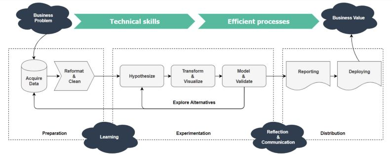
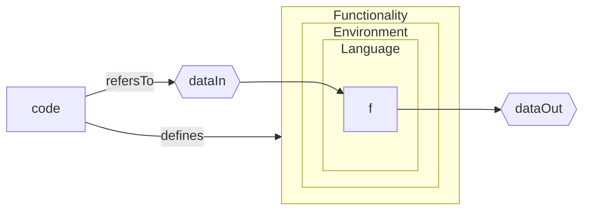
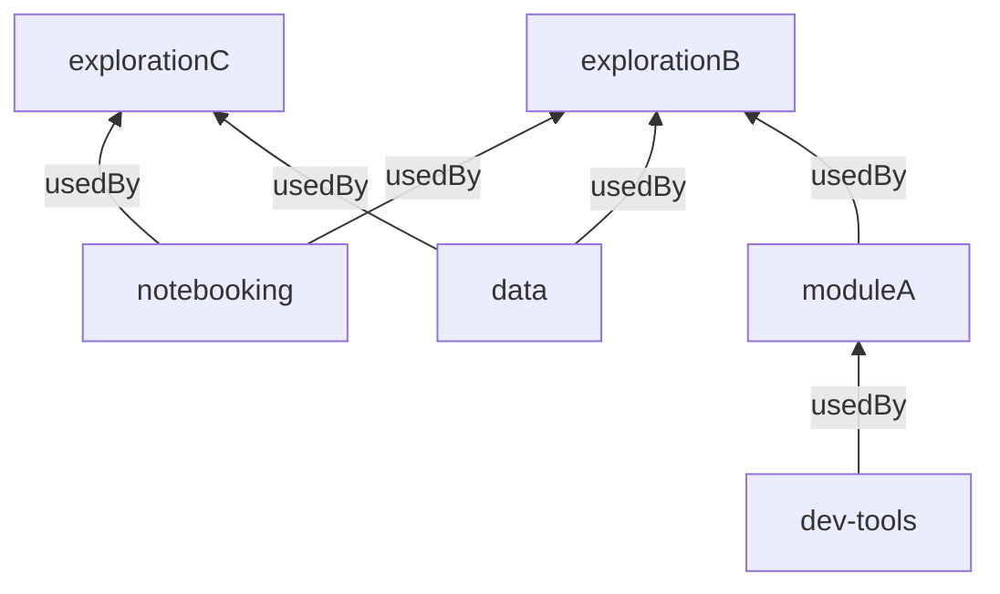
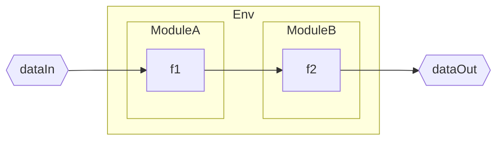
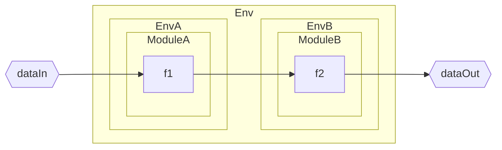
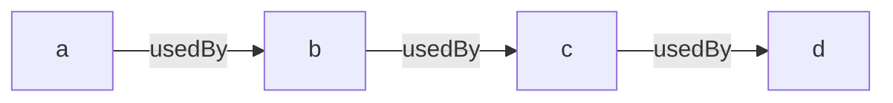
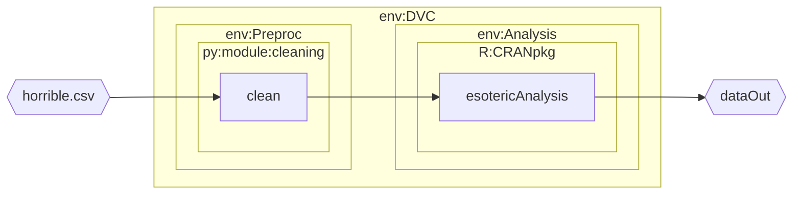
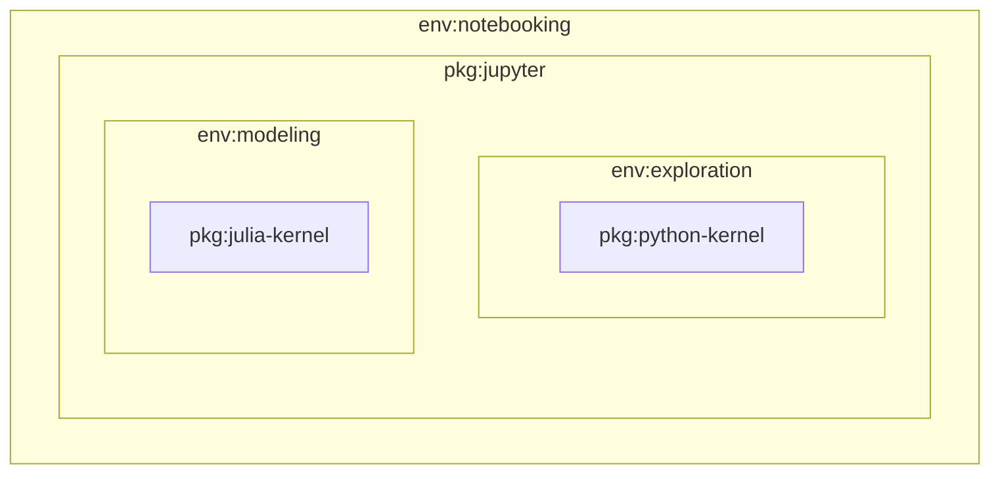
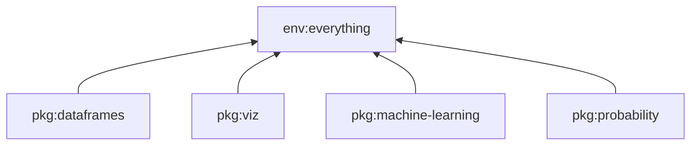
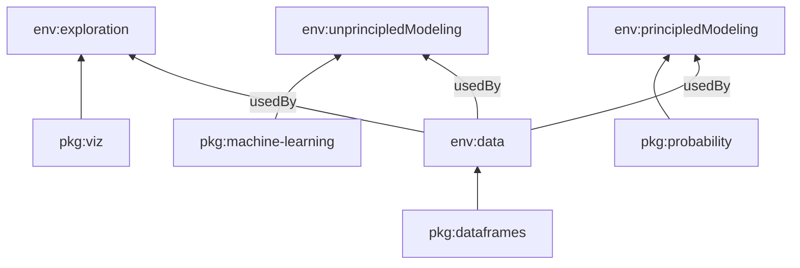

# Hydraconda:
## Multiple Related Environments for Data Science Productivity
---
# Outline

1. 🚂  **Need** (motivation): Data Science is Messy  
2. 💡 **Approach**: Use multiple related environments
3. 🎉**Benefits**: _One_ system for _many_ scenarios
4. 🤞 **Demo**: 'hydraconda' contrived project

note: more talk about the problem, less the tool

---
# 1. 🚂  Motivation:  
## Data Science is Messy

---
## Fast iteration makes for a good workflow

[The Data Science Workflow, Matt Dancho](https://www.linkedin.com/pulse/data-science-workflow-matt-dancho) 
* Business iteration ..._coupled with_
* ...Technical iteration 🔍

note:
* **Goal**: get from problem to biz value asap:
	* biz value is in supporting decisions: What decision-making process? Is it the right decision to address now?
* Top is business side while bottom is technical side
* Linear: knowledge extraction and value addition:
	* How does the product support the decisions?
	* Critical to characterize problem first as its effect cascades downstream
	* problem, data, product, and biz value have to align
* Iteration cycles:
	* must go through iterative steps to get to business value
	* each loop can progressively get 'tighter': decide where to invest in the process
* the progression:
	 1. adhoc 'one-off' exploration: don't know what the result and product will be
	 2. systemized/structured exploration: improving on initial exploration
	 * generates a variety of assets: code, viz, models, reports

---
## Data Science Workflow Practices are Maturing

**Thesis**  
The data science workflow is a hybrid between **software engineering** and **data management** due to its unique challenges and therefore requires a unique solution.

**Summary**  
As data science formalizes into a discipline, ds dev workflows have developed to address its unique challenges. 

**Question**  
What enables a workflow? How to configure and structure tools?

---
### Fundamentally: Manage assets that generate assets
* Data
* Code
	* functionality
	* data references
	* execution environments
* Data+Code
	* (computational) experiments
	* pipelines

note: talk will not focus on tools for the above

--
### Code should define everything

note: this talk emphasizes code defining functionality

---
## NEED:
### Data Science 'Messiness' Competes with 'Order'
* Messy: exploratory, non-linear
* Order: reproducibility, maintainability

note:
your time time is fixed: it can go into exploration or order creation

--
### 🛠️ Software engineering  for order imposes overhead:
* 📝source control
* 🚢modularization: packaging for distribution

--
### 🧪 Science is mostly concerned with reproducibility
* ✅📝 still need source control
* ⏳🚢 ...can put off (temporarily) software engineering rigor

--

### ⚖️Solution should manage exploration **and** order-creation 
Explore at will but always have a low-friction way to 'order'

---
# 2. 💡 Approach:
## Manage multiple related environments
---
## Manage related execution environments
* environments are the most 'accommodating containers' for executing software
* 'composes' in advantageous ways
---
## Relate Functional Dependency via Environments

reusability via environments

note: ...in contrast to creating s/w libraries
abstractly, nothing new but creating env dep is new

---
## One system *sets up* functional composition in one or multiple environments
**Established**:  One environment with libraries 'installed'

**Not so established**: Multiple environments

note:
case2 more flexible but maybe 'fatter'

---
## Multiple Environment Composition

 🔁for each env 'usedBy' x where x is a,b,c,d

0. [➕compose x] a+b+...x' = x
	1. packages
	2. environment variables
2. [🏋️‍♂️build x] install packages and set env vars
3. [⚙️ setup x] setup tasks 
4. [🎁wrap x] create environment wrapper

note:
compose step mainly handled by conda devenv
stop here as most important concepts

---
# 3. 🎉 Benefits:
## _One_ System for _Many_ Scenarios
---
## Scenario: High-Level Data Processing

**benefit**: multiple skillsets working together

note: makes heavy use of env wrappers

---
## Scenario: Controlled Notebook Computing

**benefit**: centralized, project-based mgt of notebook functionality

---
## Scenario: Path Towards Modularization
**before**:

**after**:

**benefit**: lower-effort maintainability without having to create packages

---
## Benefits Summary:

* multiple skillsets working together
	* heterogeneous computing through containment in a venv
* maintainability
	* modularization
* (iterable) reproducibility:
	* collaboration
	* deployment
* reduces chance of conflicting package requirements
* isolation with less need to containerize

---
# 4. 🤞 Demo:
### 'hydraconda' contrived project

---
### Show 'hcp' project
--
#### General
* dependency tree  
  `project project.info.work-dir-deps-tree --all-dirs`
	* everything depends on 'project'
* `environment.devenv.template.yml` controls composition
* 'project' ('root')
	- everything depends on it: even installs `git`

--
#### Specific
* 'data'
	* just data reading capability
* 'exploration'
	* depends on 'data' and 'notebooking'
* 'notebooking'
	* ipykernel installed by dep envs
	* script that gathers kernels
	* access `jupyter` from 'exploration'
* 'dvc'
	* sees everything
---
# 🎯 Conclusions
---
## Conclusion

Need to put in effort 💪 to maintain a data science project but 'hydraconda' 'lubricates' 🏄 this effort

---
## Future work: code quality
- **evolution**:
	- not designed up front, but iterated on
	- jinja+yaml looking ugly
- **ideally**: separate specification from implementation
	- create specification
---
## Credits
- Main funding: US/DoD/ESTCP/[EW19-5300](https://serdp-estcp.org/projects/details/518e4d87-3ffc-4f49-a0bc-9ee556e1d1bd)
	- DoE [record](https://www.osti.gov/doecode/biblio/74986)
- [`conda devenv`](https://github.com/ESSS/conda-devenv)
---
presentation stack:
* [Obsidian](https://obsidian.md/)
	* plugin: [Advanced Slides](https://mszturc.github.io/obsidian-advanced-slides/)
		* graphs: [Mermaid](https://mermaid.js.org/)
---
# ? 
---
